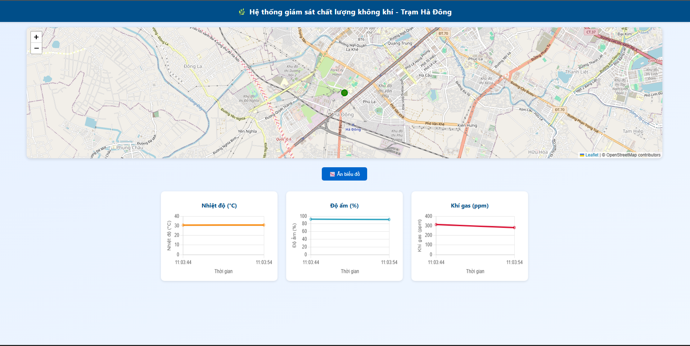
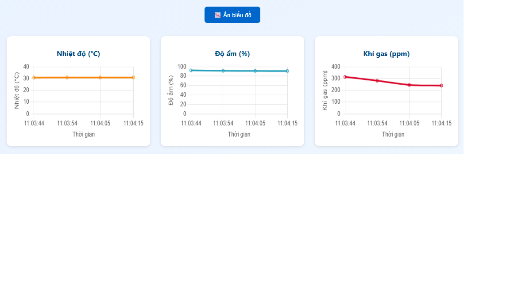

# Trạm Khí Tượng Không Khí

## Giới thiệu
Dự án Trạm Khí Tượng Không Khí nhằm xây dựng hệ thống thu thập, giám sát và phân tích dữ liệu môi trường khí quyển theo thời gian thực. Hệ thống giúp theo dõi các chỉ số quan trọng như nhiệt độ, độ ẩm, áp suất, và các chất ô nhiễm để hỗ trợ dự báo thời tiết và cảnh báo ô nhiễm.

## Tính năng chính
- Thu thập dữ liệu từ cảm biến môi trường (nhiệt độ, độ ẩm, áp suất, chất lượng không khí).
- Hiển thị dữ liệu theo thời gian thực trên giao diện web.
- Lưu trữ dữ liệu lịch sử để phân tích xu hướng.
- Cảnh báo khi chỉ số vượt ngưỡng cho phép.

## Công nghệ sử dụng
- Phần cứng: ESP32, cảm biến khí (MQ135, DHT22,...)
- Phần mềm: Python, Django (Backend)
- Frontend: ReactJS hoặc HTML/CSS/JavaScript đơn giản
- Cơ sở dữ liệu: PostgreSQL hoặc SQLite

## Hướng dẫn cài đặt

```bash
git clone https://github.com/j1weng1923/Tram-Khi-Tuong-Khong-Khi.git
cd Tram-Khi-Tuong-Khong-Khi
pip install -r requirements.txt
python manage.py runserver
